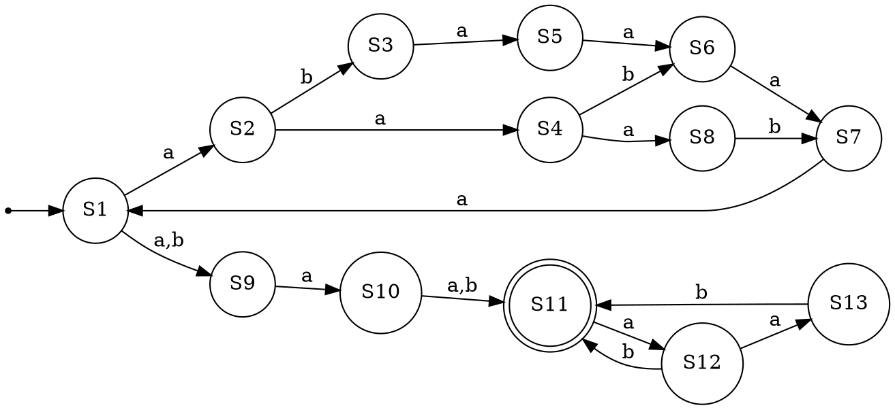

`(aabaa | aaaba | abaaaa)^*(a | b)a(a | b)(ab | aab)^*`

Получим минимальный ДКА через операцию перевода регулярки к eps-НКА  
и перевода его в НКА без eps и его минимизации до ДКА

НКА полученный путем преобразования регулярки в НКА  
.svg>)

Не минимальный ДКА  


ДКА после минимизации  
.svg>)

всего состояний 19 состояний в минимальном автомате .

таблица эквивалентностей 19 на 19

| S                 | $\varepsilon$ | aaa | aa  |  b  | aaaa | aaaaa | aaaaaa | aaaaaaa |  a  | aabaaaab | aab | aabab | aabaaaabaaaab | aabaaaabab | aaaaab | aaaaababab | baaaab | aaabaaab | babab |
| :---------------- | :------------: | :-: | :-: | :-: | :--: | :---: | :----: | :-----: | :-: | :------: | :-: | :---: | :-----------: | :--------: | :----: | :--------: | :----: | :------: | :---: |
| **aaa**           |       1        |  0  |  0  |  0  |  0   |   0   |   0    |    0    |  0  |    0     |  1  |   1   |       0       |     0      |   0    |     0      |   0    |    0     |   1   |
| **aab**           |       1        |  0  |  0  |  0  |  0   |   1   |   0    |    0    |  0  |    1     |  1  |   1   |       0       |     1      |   0    |     1      |   0    |    0     |   0   |
| **aabaab**        |       1        |  0  |  1  |  0  |  0   |   0   |   0    |    0    |  0  |    0     |  1  |   1   |       0       |     0      |   0    |     0      |   0    |    0     |   0   |
| **aabaabaa**      |       1        |  0  |  0  |  1  |  0   |   0   |   0    |    0    |  0  |    0     |  1  |   1   |       0       |     0      |   0    |     0      |   0    |    0     |   1   |
| **baa**           |       1        |  0  |  0  |  0  |  0   |   0   |   0    |    0    |  0  |    0     |  1  |   1   |       0       |     0      |   0    |     0      |   0    |    0     |   0   |
| **$\varepsilon$** |       0        |  1  |  0  |  0  |  0   |   0   |   0    |    0    |  0  |    1     |  1  |   1   |       1       |     1      |   1    |     1      |   1    |    1     |   1   |
| **a**             |       0        |  0  |  1  |  0  |  0   |   0   |   0    |    0    |  0  |    0     |  0  |   0   |       0       |     0      |   0    |     0      |   0    |    0     |   0   |
| **aabaa**         |       0        |  1  |  0  |  1  |  0   |   0   |   0    |    0    |  0  |    1     |  1  |   1   |       1       |     1      |   1    |     1      |   1    |    1     |   1   |
| **aaab**          |       0        |  0  |  0  |  0  |  1   |   0   |   0    |    0    |  0  |    0     |  0  |   0   |       1       |     1      |   1    |     1      |   0    |    0     |   0   |
| **aaba**          |       0        |  0  |  0  |  1  |  1   |   0   |   0    |    0    |  0  |    0     |  0  |   0   |       1       |     1      |   1    |     1      |   0    |    0     |   1   |
| **abaa**          |       0        |  0  |  0  |  0  |  0   |   1   |   0    |    0    |  0  |    1     |  0  |   1   |       0       |     1      |   0    |     1      |   0    |    0     |   0   |
| **aba**           |       0        |  0  |  0  |  0  |  0   |   0   |   1    |    0    |  0  |    0     |  0  |   0   |       0       |     0      |   1    |     1      |   0    |    1     |   0   |
| **ab**            |       0        |  0  |  0  |  0  |  0   |   0   |   0    |    1    |  0  |    0     |  0  |   0   |       0       |     0      |   0    |     0      |   0    |    0     |   0   |
| **aaaa**          |       0        |  0  |  0  |  1  |  0   |   0   |   0    |    0    |  0  |    0     |  0  |   0   |       0       |     0      |   0    |     0      |   0    |    0     |   1   |
| **b**             |       0        |  0  |  1  |  0  |  0   |   0   |   0    |    0    |  0  |    0     |  0  |   0   |       0       |     0      |   0    |     0      |   0    |    0     |   0   |
| **aa**            |       0        |  0  |  0  |  1  |  0   |   0   |   0    |    0    |  1  |    0     |  1  |   1   |       0       |     0      |   0    |     0      |   1    |    0     |   1   |
| **aabaaba**       |       0        |  0  |  0  |  1  |  0   |   0   |   0    |    0    |  1  |    0     |  1  |   1   |       0       |     0      |   0    |     0      |   0    |    0     |   1   |
| **ba**            |       0        |  0  |  0  |  1  |  0   |   0   |   0    |    0    |  1  |    0     |  1  |   1   |       0       |     0      |   0    |     0      |   0    |    0     |   1   |
| **aaaaa**         |       0        |  0  |  0  |  1  |  0   |   0   |   0    |    0    |  0  |    0     |  0  |   0   |       0       |     0      |   0    |     0      |   0    |    0     |   1   |
|                   |                |     |     |     |      |       |        |         |     |          |     |       |               |            |        |            |        |          |       |

Возможно минимальный НКА

.svg>)



|               | aaa | aba^5 | ba^5 | a^7 | a^6 | a^5 | a^4 | ba^4 | aa  | ab  |  b  |
| :-----------: | :-: | :---: | :--: | :-: | :-: | :-: | :-: | :--: | :-: | :-: | :-: |
| $\varepsilon$ |  1  |       |      |     |     |     |     |      |     |     |     |
|       a       |  0  |   1   |      |     |     |     |     |      |     |     |     |
|      aa       |  0  |   0   |  1   |     |     |     |     |      |     |     |     |
|      ab       |  0  |   0   |  0   |  1  |     |     |     |      |     |     |     |
|      aba      |  0  |   0   |  0   |  0  |  1  |     |     |      |     |     |     |
|     abaa      |  0  |   0   |  0   |  0  |  0  |  1  |     |      |     |     |     |
|     abaaa     |  0  |   0   |  0   |  0  |  0  |  0  |  1  |      |     |     |     |
|      aaa      |  0  |   0   |  0   |  0  |  0  |  0  |  0  |  1   |     |     |     |
|       a       |  0  |   0   |  0   |  0  |  0  |  0  |  0  |  0   |  1  |     |     |
|     aaaa      |  0  |   0   |  0   |  0  |  0  |  0  |  0  |  0   |  0  |  1  |     |
|     aaaaa     |  0  |   0   |  0   |  0  |  0  |  0  |  0  |  0   |  0  |  0  |  1  |

ПКА:  
.svg>)

|               | $\varepsilon$ | aaa | abaaaabab | baaaabab | baaaababab | aababababab |
| ------------- | -------------: | --- | --------- | -------- | ---------- | ----------- |
| $\varepsilon$ | 0             | 1   | 1         | 1        | 1          | 1           |
| a             |               | 0   | 1         | 1        | 1          | 1           |
| aa            |               |     | 0         | 1        | 1          | 1           |
| aaa           |               |     |           | 0        | 1          | 1           |
| aab           |               |     |           |          | 0          | 1           |
| aaab          |               |     |           |          |            | 0           |

```text
(aabaa | aaaba | abaaaa)^*(a | b)a(a | b)(ab | aab)^*
= (aabaa|aaaba|abaaaa)^*(?=.a.(.)*).a.(ab|aab)*
```

Расширенное выражение $R'$ эквивалентно исходному выражению $R$, поскольку они описывают один и тот же язык $L$. Эквивалентность достигается за счет использования предпросмотра для избыточной проверки, которая не меняет язык, но соответствует требованию использования данной операции.

Исходное выражение $R$ состоит из конкатенации трех языков $L_1 L_2 L_3$:

$$
R =
\underbrace{(\text{aabaa}|\text{aaaba}|\text{abaaaa})^{*}}_{\mathbf{L}_{1}}
\underbrace{(\text{a}|\text{b})\text{a}(\text{a}|\text{b})}_{\mathbf{L}_{2}}
\underbrace{(\text{ab}|\text{aab})^{*}}_{\mathbf{L}_{3}}
$$

В расширенном выражении $R'$ потребляющая символы часть остается той же: $\mathbf{L}_{1} \dots \mathbf{L}_{2} \mathbf{L}_{3}$, где $L_2$ записан как `.a.`.

### 2. Принцип Работы Предпросмотра

Операция позитивного предпросмотра вперёд `(?=.a.(a|b)*)` выполняет проверку с текущей позиции (после $L_1$) и до конца строки:

- **Проверяемое условие ($\tau'$):** За $L_1$ должно следовать `.a.(a|b)*`.

- **Фактическое сопоставление:** Сразу после проверки следует сопоставление `.a.(ab|aab)*`.


Поскольку язык $(\text{ab}|\text{aab})^{*}$ является подмножеством универсального языка $(\text{a}|\text{b})^{*} \equiv \Sigma^{*}$, любое успешное сопоставление `.a.(ab|aab)*` **автоматически** гарантирует выполнение более слабого условия `.a.(a|b)*`.

Следовательно, блок предпросмотра `(?=...)` не отфильтровывает никаких строк, которые в противном случае были бы приняты основным выражением, и не допускает никаких новых строк. Это подтверждает эквивалентность $R'$ и $R$
