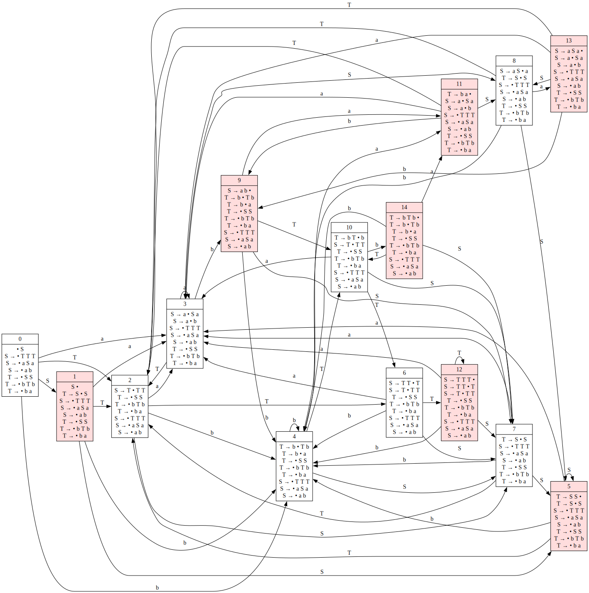

# Анализ контекстно-свободной грамматики (КС-грамматики)

## Исходная грамматика

$$
\begin{aligned}
S &\to TTT \\
S &\to aSa \\
S &\to ab \\
T &\to SS \\
T &\to bTb \\
T &\to ba
\end{aligned}
$$
   

## 1. Проверка на DCFL (Deterministic Context-Free Language)

Проверим язык на принадлежность классу DCFL.

Рассмотрим слова:
$$w_1 = a^naba^n$$
$$w_2 = a^naba^na^nba^nbaba$$

Рассмотрим префикс $x = a^nba^{n-1}$.
При накачке $a^{n-1}$ слово $w_1$ выходит из языка $\to L \notin DCFL$.

Также это является проверкой на беспрефиксность.

_1.svg)

### Анализ недетерминизма

Недетерминизм присутствует на переходах из состояния **q1** по стеку **T** и по стеку **S**.

**Конфликтующие пары переходов:**

```text
// По верхушке стека S
q1 -> q1 [label = "ε, S / TTT"];
q1 -> q3 [label = "a, S / ε"];

// По верхушке стека T
q1 -> q1 [label = "ε, T / SS"];
q1 -> q2 [label = "b, T / ε"];
```

### Примеры конфликтов

**Сценарий 1:**
$$S \to TTT \to b^nTb^nbaba \to b^nbab^nbaba$$
$$S \to TTT \to b^nTb^nbaba \to b^nSSb^nbaba \to b^nababb^nbaba$$

Слова:
1. $w_1 = b^nbab^nbaba$
2. $w_2 = b^na^naba^nabb^nbaba$

Общий префикс $x = b^n$. Далее в одной ветке происходит закладка $SS$ (состояние стека: $SSb^nTT$), а в другой — одна $b$ и далее всего одна $T$ (состояние стека: $b^nTT$).

**Сценарий 2:**
$$a^naba^n$$
$$a^nbababaa^n$$

После чтения $a^n$ на стеке находится либо $a^n$, либо $TTTa^n$.

**Дополнительный недетерминизм:**

1. **Из состояния q2:**
   ```text
   q2 -> q1 [label = "ε, T / Tb"];
   q2 -> q1 [label = "a"];
   ```
   Рассмотрим слова:
   - $w_1 = b^nbab^nbaba$
   - $w_2 = b^nab^{n-1}baba$
   
   После чтения префикса $b^{n-1}$ на стеке либо $b^{n-1}TT$, либо $Tbb^{n-1}TT$.

2. **Из состояния q3:**
   ```text
   q3 -> q1 [label = "ε, S / Sa"];
   q3 -> q1 [label = "b"];
   ```
   Рассмотрим слова:
   - $w_1 = a^naba^n$
   - $w_2 = a^nababbabaaa^n$
   
   После чтения $a^{n-1}$ на стеке $Sa^{n-1}$ или $a^{n-1}$.

---

## 2. LR(0) аппроксимация позиционным автоматом

Диаграммы состояний позиционного автомата:


_1.svg)
.svg)


### Пересечение с грамматикой

Результат пересечения грамматики с автоматом:

$$
\begin{aligned}
S &\to S_{14} \\\\
S_{14} &\to ab \mid a S_{24} a \mid T_{14} T_{44} T_{44} \\
S_{24} &\to ab \mid a S_{24} a \mid T_{24} T_{44} T_{44} \\
S_{34} &\to ab \mid a S_{44} a \mid T_{34} T_{44} T_{44} \\
S_{44} &\to ab \mid a S_{44} a \mid T_{44} T_{44} T_{44} \\\\
T_{14} &\to ba \mid b T_{34} b \mid S_{14} S_{44} \\
T_{24} &\to ba \mid b T_{44} b \mid S_{24} S_{44} \\
T_{34} &\to ba \mid b T_{34} b \mid S_{34} S_{44} \\
T_{44} &\to ba \mid b T_{44} b \mid S_{44} S_{44}
\end{aligned}
$$

---

## 3. LL(1) аппроксимация

Разметка правил для анализа:

1. $S \to T T T$
2. $S \to a_1 S a_2$
3. $S \to a_3 b_1$
4. $T \to S S$
5. $T \to b_2 T b_3$
6. $T \to b_4 a_4$

### Множества First, Follow и Last

$$First(S) = First(T) = \{ a_1, a_3, b_2, b_4 \}$$

$$Follow(S) = Follow(T) = \{ a_1, a_2, a_3, b_2, b_3, b_4, \epsilon \}$$

$$Last(S) = Last(T) = \{ b_1, a_2, a_4, b_3 \}$$

.svg)


### Результирующая грамматика LL(1)

$$
\begin{aligned}
S &\to S_{12} \\
S_{12} &\to ab \mid a S_{22} a \mid T_{12} T_{22} T_{22} \\
S_{22} &\to ab \mid a S_{22} a \mid T_{22} T_{22} T_{22} \\
T_{12} &\to ba \mid b T_{22} b \mid S_{12} S_{22} \\
T_{22} &\to ba \mid b T_{22} b \mid S_{22} S_{22}
\end{aligned}
$$
